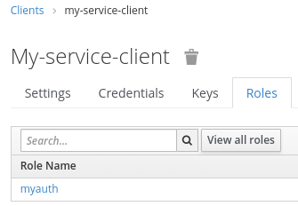

# openidc-clientRoleMapping

## Spring Default

Default-Implementation of Spring Security adds all entries in `scope`-Claim of JWT as `autority` to the User created:

```java
for(String authority:token.getScopes()){
        authorities.add(new SimpleGrantedAuthority("SCOPE_"+authority));
        }
```

If we do want to secure our Spring application we can now use

```java
public class WebSecurityConfig extends WebSecurityConfigurerAdapter {
    @Override
    protected void configure(HttpSecurity http) throws Exception {
        http
                .authorizeRequests(authz -> authz
                        .antMatchers("/ui/**").hasAuthority("SCOPE_myauth")
                        .anyRequest().denyAll())
                .oauth2Login();
    }
}
```

or

```java

@RestController
@RequestMapping("/rest")
public class MyController {
    @GetMapping(produces = MediaType.APPLICATION_JSON_VALUE,
            path = "/{someId}")
    @PreAuthorize("hasAuthority('SCOPE_myauth')")
    public ResponseEntity getEnty(@PathVariable String someId) {
    }
}
```

### Problem

If using [keycloak](www.keycloak.org) as oauth/openidc auth-server we want to use `groups` or `roles` to resctrict
access to our services for the users.

So we define a `client` *my-service-client* (for the resource-server) and this `client` defines a `role` *myauth*:



And we configure our Spring-Application to use this keycloak-instance as a oauth2-Provider:

```yaml
spring:
  security:
    oauth2:
      client:
        registration:
          keycloak:
            clientId: my-service-client
            clientSecret: my-service-client-secret
        provider:
          keycloak:
            issuerUri: ${env.keycloak.protocol}://${env.keycloak.host}:${env.keycloak.port}/auth/realms/myRealm
```

What we now get is a JWT-Token that looks something like this:

```json
{
  "resource_access": {
    "my-service-client": {
      "roles": [
        "myauth"
      ]
    }
  },
  "scope": "openid profile email",
  "preferred_username": "myusername"
}
```

Now we can use the three entries in `scope` for Spring Security as `hasAuthority('SCOPE_profile')`.

But we want to use the entry in `resource_access.my-service-client.roles`

## openidc-clientRoleMapping

`MappingOidcUserService.class` does read entries in `resource_access.my-service-client.roles` and adds them
as `authorities` to the `OidcUser`.

### Prerequisites

1. You have to enable openid

```yaml
spring:
  security:
    oauth2:
      client:
        registration:
          keycloak:
            scope: openid
```

2. You have to define your client-name (a second time)

```yaml
oidc:
  clientrolemapping:
    client: my-service-client
    resourceAccess: // optional, default is resource_access
    role: // optional, default is roles
```

3. Use the Bean as oidcUserService

```java
public class WebSecurityConfig extends WebSecurityConfigurerAdapter {

    @Autowired
    private MappingOidcUserService oidcUserService;
    
    @Override
    protected void configure(HttpSecurity http) throws Exception {
        http
                .authorizeRequests(authz -> authz
                        .antMatchers("/ui/**").hasAuthority("SCOPE_myauth")
                        .anyRequest().denyAll())
                .oauth2Login().userInfoEndpoint().oidcUserService(oidcUserService);
    }
}
```